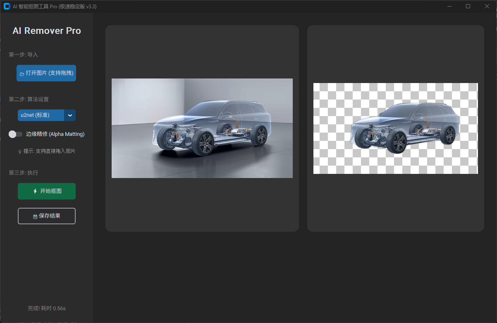

# AI Background Remover Pro 🚀

    

一个基于 Python、Rembg 和 ONNX Runtime 的高性能本地 AI 智能抠图工具。
专为 Windows 打造，拥有现代化的深色 GUI 界面，支持 GPU 加速，实现了**极速启动**与**完全离线运行**。

## ✨ 核心功能

*   **⚡ 极速启动 (Instant Start)**：采用后台异步加载技术，软件启动时间 < 1秒，拒绝等待。
*   **🖱️ 拖拽支持 (Drag & Drop)**：**[v3.3 新增]** 直接将图片文件拖入窗口即可打开，操作更流畅。
*   **💾 智能保存 (Smart Save)**：**[v3.3 新增]** 保存时自动保留原文件名并添加后缀 (如 `photo_rmbg.png`)，无需手动重命名。
*   **🎮 GPU 硬件加速**：原生支持 NVIDIA 显卡加速 (CUDA)，处理 4K 高清图片仅需几秒。
*   **🧠 多模型集成**：
    *   **u2net (标准版)**: 平衡速度与精度，适合大多数场景。
    *   **isnet-general-use (高精度)**: **强力推荐**！专攻暗色背景、复杂细节（如头发、网格），识别率极高。
    *   **isnet-anime (动漫版)**: 针对二次元插画、动漫角色优化的专用模型。
*   **💎 边缘精修 (Alpha Matting)**：内置 Alpha Matting 算法，可完美处理半透明物体（如玻璃、光效、薄纱）。
*   **🔒 完全离线 & 隐私安全**：所有计算均在本地完成，无需上传图片到服

2. 安装依赖
建议使用 Python 3.10 或 3.11 版本。

bash
# 安装核心依赖
pip install customtkinter rembg pillow watchdog

# 安装 GPU 加速支持 (必须有 NVIDIA 显卡)
pip install onnxruntime-gpu

3. 准备模型文件 (关键)
由于 GitHub 文件大小限制，源码中未包含模型文件。请在项目根目录下新建 models 文件夹，并下载以下 .onnx 文件放入其中：

* u2net.onnx
* isnet-general-use.onnx
* isnet-anime.onnx

目录结构应如下所示：

text
Project_Root/
├── ai_remover.py
├── models/
│   ├── u2net.onnx
│   ├── isnet-general-use.onnx
│   └── isnet-anime.onnx
└── ...

4. 运行
bash
python ai_remover.py

📦 如何打包成 EXE
如果您想自己编译 EXE 文件，请安装 PyInstaller：

bash
pip install pyinstaller

然后使用以下命令进行打包。注意：必须使用 --collect-all tkinterdnd2 参数，否则拖拽功能会失效。

powershell
pyinstaller --noconfirm --onedir --windowed --add-data "models;models" --collect-all tkinterdnd2 --name="ai_remover" ai_remover.py

--onedir: 生成文件夹（推荐，启动更快，方便替换模型）。
--collect-all tkinterdnd2: 关键参数，强制收集拖拽库的所有依赖文件。
--add-data "models;models": 将本地模型打包进去，实现离线运行。
❓ 常见问题
Q: 为什么打开软件报错 "Model not found"? A: 请检查 models 文件夹是否存在，以及里面是否包含了对应的 .onnx 文件。
Q: 如何确认是否使用了 GPU? A: 软件启动时，控制台或后台日志不会报错。如果处理速度非常快（<1秒），通常说明 GPU 正在工作。如果是 CPU 模式，处理一张图可能需要 3-5 秒。
Q: 处理半透明物体效果不好？ A: 请尝试开启界面左侧的 "边缘精修 (Alpha Matting)" 开关。
Q: 打包后启动报错 "Unable to load tkdnd library"? A: 请确保打包命令中包含了 --collect-all tkinterdnd2。
📄 许可证
本项目基于 MIT License 开源。 核心算法基于 Rembg 项目。